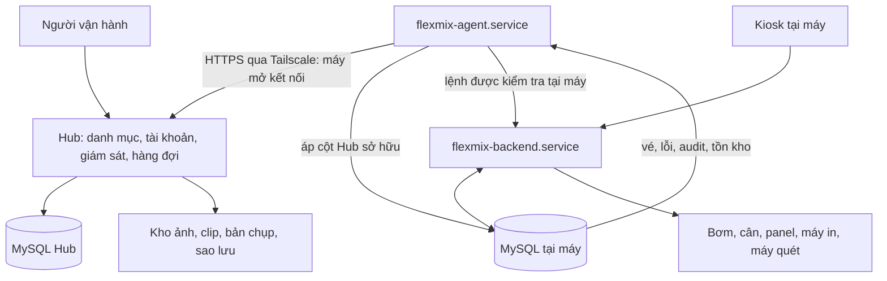

# Kiến trúc hệ thống

> Nguồn: [Kiến trúc đội máy FlexMix](../Kien_Truc_Doi_May.html), đề xuất bản 3 ngày 10/09/2026, tham chiếu `version1.0 @ ce17f05`. Tài liệu này được tách từ HTML; chưa đối chiếu mã nguồn ứng dụng và không xác nhận chức năng đã triển khai. “Yêu cầu” là mục tiêu trong đề xuất, “hiện trạng” là mô tả của nguồn, “đề xuất bổ sung” cần được duyệt. Các điểm chưa chốt nằm trong [OPEN_QUESTIONS.md](OPEN_QUESTIONS.md).

## Cập nhật từ OWNER — DRAFT, 17/09/2026

DEC-001 (DRAFT): một thực đơn chung cả đội. Override theo điểm chưa được OWNER xác nhận; A-01 chỉ được trả lời phần menu chung.

DEC-003 (DRAFT): không đặt ở máy này rồi lấy ở máy khác; vé vẫn thuộc máy.

Theo DEC-006 (DRAFT), recipe được ghim tại thời điểm tạo ticket; recipe mới chỉ áp dụng cho ticket tạo sau khi version mới được publish, không đổi ticket đang tồn tại. C-17 vẫn giữ yêu cầu cửa sổ yên tĩnh cho thay đổi mã nguyên liệu; điều kiện chính xác và quy tắc xóa mềm vẫn mở tại Q-11. Pin recipe không bãi bỏ C-17 hoặc cho phép áp chúng ngay. Quan hệ publish tại Hub với apply tại máy offline và cách lưu recipe chưa chốt.

DEC-007 (DRAFT, nguồn ô Q-22; mapping sang Q-21 là đề nghị biên tập, chờ OWNER xác nhận): không cho Machine nhận order khi khởi động offline và chưa sync clock. Không suy ra RTC bắt buộc hoặc cơ chế xác nhận sync; Q-21 vẫn còn phần mở, Q-22 chưa được trả lời.

Các DEC được ghi tại [06_decisions.md](06_decisions.md), chưa ACCEPTED và chưa là căn cứ triển khai. Phần nguồn/hiện trạng được giữ để truy nguyên.

## Thành phần và ranh giới

Hub quản lý trạng thái mong muốn và quan sát; máy giữ thẩm quyền vé, tồn kho và phần cứng. Backend gồm store `:8080`, `sync_menu`, `run_flow`. Agent là systemd unit riêng: lỗi mạng không được kích hoạt cơ chế `os._exit(1)` của nhóm thread backend.

Không dùng MySQL replication, không biến máy thành client mỏng, không chạy agent thành thread của `main.py`, không mở `:8080` trên LAN tiệm. Tailscale SSH là đường bảo trì thủ công riêng. Danh sách đầy đủ và lý do: §Hướng đã cân nhắc và loại bỏ.

## Luồng danh mục xuống

1. Agent gọi `GET /v1/state?have=<version>`; Hub trả 304 hoặc bản chụp đã lọc theo máy.
2. Kiểm contract, danh tính đích, yêu cầu schema, chữ ký; tải assets thiếu và kiểm hash/kích thước.
3. Phân loại thay đổi. Giá, tên, ảnh có thể áp ngay với bảo vệ lệch giá. Theo DEC-006 (DRAFT), recipe được ghim tại thời điểm tạo ticket; recipe mới chỉ áp dụng cho ticket tạo sau khi version mới được publish, không đổi ticket đang tồn tại. C-17 vẫn giữ yêu cầu cửa sổ yên tĩnh cho thay đổi mã nguyên liệu; điều kiện chính xác và quy tắc xóa mềm vẫn mở tại Q-11. Pin recipe không bãi bỏ C-17 hoặc cho phép áp chúng ngay. Quan hệ publish tại Hub với apply tại máy offline và cách lưu recipe chưa chốt.
4. Trong một transaction dữ liệu, chỉ upsert cột Hub sở hữu; `recipe` và `recipe_action` cùng transaction vì chung dãy `step_no`.
5. Tính lại dữ liệu dẫn xuất, ghi phiên bản đã áp, chạy `sync_menu` để dựng lại menu tại máy.
6. Lỗi trước commit: rollback, giữ menu cũ và báo Hub. Lỗi sau commit khi dựng menu cần cơ chế phục hồi riêng, chưa được nguồn định nghĩa (Q-22).

Không áp DDL trong transaction danh mục. DDL là đường migration riêng. Định dạng ký snapshot chưa chốt; không mặc định sử dụng khóa ký release.

## Luồng sự kiện lên

Agent đọc bảng cục bộ bằng cursor, không thêm outbox trên đường bán. `error_log` theo `error_id`; vé theo `updated_at` với khoảng đọc chồng lấn. Hub upsert vé bằng `(machine_id, serial)`; ACK xác nhận đúng cursor đã ghi trước khi máy lưu mốc mới. Tồn kho, khe cắm, sức khỏe là ảnh chụp định kỳ. Audit và backup có đường gửi riêng về mặt nội dung; endpoint chi tiết chưa chốt.

Mất kết nối: retry, giữ cursor, backend tiếp tục làm việc. Độ bền chỉ đạt được khi dữ liệu chưa gửi còn giữ tại máy; thời hạn dọn dữ liệu phải phù hợp Q-14.

## Năng lực và phân phối thực đơn

Hub nhận bản đồ `gpio`/khe cắm và đối chiếu công thức. Món thiếu bơm hoặc panel cần thiết không được gửi xuống như món bán được. Tiền kiểm gồm giới hạn 10 PUMP, 16 MANUAL, mã lựa chọn ≤24, số lựa chọn ≤12, trọng lượng mã hóa ≤9999 g.

Nguồn phân biệt ba trạng thái của một món, và màn hình phải nói khác nhau vì nhân viên xử lý khác nhau:

| Trạng thái | Nghĩa | Ai đặt | Nhân viên làm gì |
|---|---|---|---|
| Không pha được ở đây | Máy không có khe cho nguyên liệu của món | Hub tính từ bản đồ khe cắm | Không làm gì được, phải đổi cách đi dây |
| `drink.available` | "Hôm nay tiệm không bán món này" | Nhân viên tại quầy | Bật lại khi muốn bán |
| `drink.in_stock` | Một nguyên liệu dưới ngưỡng | Trigger MySQL tự tính | Châm thêm nguyên liệu |

Món không pha được ở đây bị lọc khỏi bản chụp tại Hub, không gửi xuống rồi để máy ẩn. `drink.published` ("món thuộc thực đơn điểm bán này") là một cột riêng trong bảng sở hữu, xem DATABASE_SPEC.

Hiện trạng theo nguồn: màn hình quản trị (`admin_gui/serve.py`, `ingredients.js`) không so với `INGREDIENT_MAX` hay `MAX_PAIRS`. Ba lỗi vì thế chỉ lộ ra muộn: topping có id > 24 làm `qrproto` ném lỗi lúc in nhãn; món có 13 lựa chọn không mã hóa được payload; nguyên liệu PUMP chưa khai cột `gpio` làm `export_data.py` ném `ValueError` khi quét, tức là sau khi khách đã trả tiền. Tiền kiểm có bao phủ trường hợp thứ ba hay không, và chạy ở đâu, còn mở tại Q-29.

Hub cấp mã lựa chọn trống thấp nhất theo từng máy, giữ cả mã đã ngừng sử dụng; hết mã thì từ chối phát hành có giải thích. Không đánh số lại để thu hồi vùng mã. Giữ nguyên mã nguyên liệu đang lưu hành và dùng ánh xạ chuẩn ở Hub.

Một danh mục chung theo DEC-001 (DRAFT); ghi đè giá/trạng thái theo điểm bán vẫn là giả định nguồn. `store_setting` được giải theo ưu tiên máy > điểm bán > đội; Hub gửi kết quả đã giải. `published` không thay thế `available` do nhân viên quầy làm chủ.

## Nhận máy hiện hữu

- Máy đầu: tải danh mục dưới dạng đề xuất, duyệt và giữ nguyên ID làm danh mục chuẩn ban đầu.
- Máy sau: so theo tên, người duyệt từng trường hợp đồng nghĩa/khác nghĩa; lập ánh xạ mã riêng, không sửa mã tại máy.
- Gửi lịch sử vé/lỗi kèm MID, không viết lại serial hoặc quá khứ.
- Kiểm thực đơn tính được với thực đơn đang bán trước khi bật đồng bộ xuống.

## Ma trận suy giảm theo nguồn

“Giảm” nghĩa là một phần chức năng còn hoạt động. Bảng mô tả tác động hiện trạng, không bảo đảm các lỗi cục bộ đã được sửa. Nguồn gọi bảng này là "hợp đồng của thiết kế". Hàng "Đồng hồ sai" ghi Bán = Có cho hiện trạng; nguồn không nói hàng này đổi thành gì sau khi áp yêu cầu đồng bộ giờ trước khi nhận đơn. DEC-007 (DRAFT) đã ghi điều kiện không nhận order khi boot offline chưa sync clock. Các ô “Có” dưới đây là hiện trạng nguồn, không cho phép bỏ điều kiện này; tiêu chí sync và RTC vẫn mở tại Q-21.

| Sự cố | Bán | Pha | In | Quản trị máy | Đồng bộ |
|---|---|---|---|---|---|
| Mất mạng/Hub | Có | Có | Có | Có | Dừng |
| Agent lỗi | Có | Có | Có | Có | Dừng |
| MySQL máy dừng | Dừng | Dừng | Dừng | Dừng | Chỉ beat |
| Máy in lỗi | Giảm | Có | Dừng | Có | Có |
| Máy quét lỗi | Giảm | Có | Có | Có | Có |
| Panel I2C treo | Có | Giảm | Có | Có | Có |
| Cân sai | Có | Dừng | Có | Có | Có |
| Kiosk chết | Dừng | Có | Có | Có | Có |
| Đồng hồ sai | Có | Giảm | Có | Giảm | Giảm |
| Khách bỏ đi tại cổng chờ | Dừng | Dừng | Có | Có | Có |
| Quên tắt test | Giảm | Dừng | Có | Có | Có |
| Đầy thẻ nhớ | Dừng | Dừng | Dừng | Dừng | Giảm |
| Bán quá tồn | Có | Giảm | Có | Có | Có |
| Mất điện | Dừng | Dừng | Dừng | Dừng | Dừng |
| Tailscale hết hạn khóa nút | Có | Có | Có | Giảm | Dừng |
| Snapshot sai | Giảm | Có | Có | Có | Có |
| Hub bị chiếm quyền | Có* | Có* | Có* | Có* | Cần cắt |
| Mất thẻ nhớ | Dừng | Dừng | Dừng | Dừng | Dừng |

(*) Có điều kiện: máy phải tự kiểm chữ ký release, bảo vệ API cục bộ và chốt lệnh phần cứng. Hub vẫn có thể sửa giá/thực đơn và gây gián đoạn bằng quyền hợp lệ; xem SECURITY_SPEC.

Máy in/quét lỗi: có thể chuyển `runDirect`. Mất điện giữa ly: nguồn mô tả `release_stranded()` trả vé `unused`, `reset_machine_hardware()` đưa phần cứng về nghỉ; cần đồng hồ đúng. Khách bỏ đi: timeout tại máy và `cancel-current-order`, không trông cậy `release-stranded` khi runner còn bận.

## Hướng đã cân nhắc và loại bỏ

Chép từ mục "Những hướng không chọn" của nguồn, kèm lý do nguồn nêu. Các hướng này có phải ràng buộc cho các bản thiết kế sau hay chỉ là ghi chép lý do của bản 3 còn mở tại Q-31.

| Hướng bị loại | Lý do theo nguồn | Nơi giữ kết quả |
|---|---|---|
| Máy làm replica của MySQL | Replication là được ăn cả ngã về không trên schema mà cả hai bên đều ghi, trong khi máy làm chủ tồn kho và vé. Nó cần mở cổng vào máy và biến một lần đứt mạng thành một lần mất dữ liệu | C-30 |
| Một database trên mây, máy làm client mỏng | Tiệm mất mạng là không bán được. Nó thêm hàng trăm mili-giây vào `claim()`, vốn là UPDATE nguyên tử tại chỗ và là lý do một nhãn không dùng được hai lần | C-30, C-02 |
| Đánh số lại nguyên liệu cho toàn đội | Âm thầm đổi nghĩa mọi tờ nhãn đang lưu hành. Bảng ánh xạ ở Hub cho cùng kết quả mà không đụng giấy đã in | C-13 |
| Một `QRPROTO_KEY` dùng chung cả đội | Nhãn in ở tiệm này chạy được ở tiệm khác, và một lần lộ khóa thành một lần in lại toàn đội. Khóa riêng chỉ tốn rủi ro mất thẻ nhớ | C-30, C-20 |
| Cho `:8080` nghe trên LAN để Hub gọi vào | Xóa bỏ quyết định bảo mật đã có (`net_addresses.py`, `served_paths.py`). Chỉ gọi ra cho cùng kết quả và sống sót qua NAT, captive portal, tiệm đổi router | C-04 |
| Thêm agent làm thread thứ tư trong `main.py` | Hợp đồng `os._exit()` toàn tiến trình đúng cho ba thread phải cùng sống mới bán được; buộc client mạng vào đó biến sự cố Hub thành thời gian chết của tiệm | C-03 |
| Gom hiệu chuẩn bơm về trung tâm | Giá trị hiệu chuẩn mô tả một dây bơm trên một máy; dùng chung là pha sai ở khắp nơi | C-30 |
| Đẩy ghi chú của khách lên Hub | Gom dữ liệu cá nhân của mọi khách ở mọi tiệm vào một chỗ, giữ mãi, cho những báo cáo không cần nó | C-20 |
| Để Hub tự dựng và tự ký bản phát hành | Xóa tài sản quý nhất của thiết kế: Hub bị chiếm quyền thì tiệm vẫn bán, vẫn pha, khóa QR vẫn an toàn. Hub gọi tên một bản đã ký, không tạo ra bản nào | C-24 |
| Đánh số lại `ingredient_id` cho gọn vùng 1–24 | Cùng sai lầm với đánh số lại toàn đội ở quy mô một máy: đổi nghĩa mọi nhãn đang lưu hành. Vùng 1–24 được giữ cho nguyên liệu khách chọn được từ đây trở đi; mã đã cấp để yên | C-15 |
