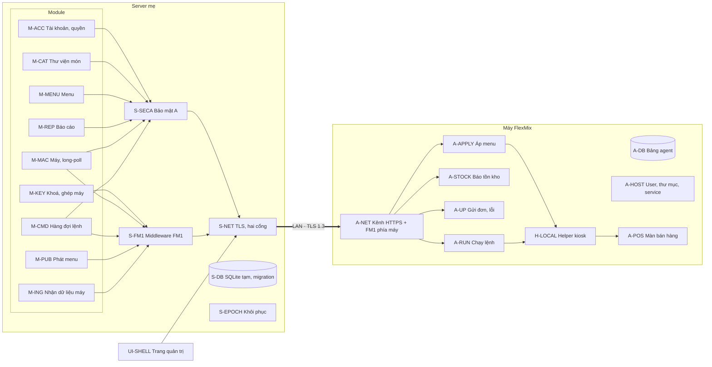

# Kế hoạch xây dựng server mẹ FlexMix theo khối (bản 2)

- **Trạng thái:** ĐANG THỰC HIỆN. Codex tiếp quản Claude; đã có bản nháp C0,
  S-DB SQLite tạm, S-NET và UI-SHELL. Đã sửa 2 lỗi P2, 1 lỗi P3; reviewer
  kiểm lại đạt trong phạm vi sửa. Kiểm trên Windows: **161 test Python đạt**
  (34.11 s), kiểm UI bằng Node đạt. Chưa nghiệm thu Pi/MySQL/Linux hoặc ráp R1.
- **Lập ngày:** 2026-10-08. Ngày 08/10, user chọn tổ chức lại plan theo khối thay cho theo phase. Bản theo phase lưu ở `luu_ban_theo_phase/` để đối chiếu.
- **Nguồn thiết kế:** `docs/server_architect.html` (bản 2). Các khối lấy đúng theo sơ đồ tổng quan ở mục 1 của thiết kế.
- **Hồ sơ nền:** `agents/memory/hieu_biet_server_me.md`, `phuong_an_kien_truc.md`, `crypto_*.md`, `quy_uoc_so_do.md`.

| File | Nội dung |
|---|---|
| [hop_dong.md](hop_dong.md) | Tầng 0: cổng mật mã G0 và các hợp đồng C0 mà mọi khối dựa vào |
| [khoi_server.md](khoi_server.md) | 15 khối phía server: nền, khung trang, bảo mật, 9 module, khối khôi phục |
| [khoi_may.md](khoi_may.md) | 9 khối phía máy: agent, helper, màn bán hàng |
| [rap_trien_khai.md](rap_trien_khai.md) | 6 lần ráp R1–R6 và triển khai X1–X6 |
| [giao_viec/README.md](giao_viec/README.md) | Phân việc và trạng thái thực thi |
| [bang_chung/REVIEW_CODEX.md](bang_chung/REVIEW_CODEX.md) | Phát hiện, sửa lỗi, hồi quy và review lại |
| [giao_viec/CODEX_SQLITE_THONG_BAO_CLAUDE.md](giao_viec/CODEX_SQLITE_THONG_BAO_CLAUDE.md) | Bàn giao Claude; SQLite tạm, migrate MySQL sau |
| `cong_cu/dung_trang_plan.js` | Dựng lại `docs/server_plan.html` từ các file trên: `node internal/plan/cong_cu/dung_trang_plan.js` (chạy từ `server/`). Sửa plan thì sửa Markdown, không sửa tay HTML |
| `cong_cu/check_trang_plan.cjs` | Kiểm trạng thái, link và HTML khớp Markdown: `node internal/plan/cong_cu/check_trang_plan.cjs` |

## Tiến độ hiện tại

Cập nhật 08/10/2026. Đây là kết quả trên máy dev; ký hiệu → giữ lại khi còn
điều kiện nghiệm thu. Trang HTML đọc bảng này để đồng bộ trạng thái các khối.

| Khối | Trạng thái | Đã có / còn chờ | Bằng chứng |
|---|---|---|---|
| G0 | → | G0.1–G0.5 đạt trên dev, G0.7 đạt với N=10 giả định; G0.6 chờ benchmark Pi thật | [G0.md](bang_chung/G0.md) |
| C0 | → | C0.1/C0.2 đã commit; vector, hợp đồng nháp, settings và kiểm import đã có; review không có lỗi mới. Chờ Q1, binding enroll và duyệt hợp đồng mật mã | [C0.md](bang_chung/C0.md) |
| S-DB | → | SQLite tạm; P2 migration số cũ đã sửa, hồi quy và review lại đạt. Chưa có schema nghiệp vụ; chờ migrate MySQL và R1 | [S-DB.md](bang_chung/S-DB.md) |
| S-NET | → | TLS, hai pool, CA, wake trên dev; P2 shutdown/P3 redirect đã sửa, hồi quy và review lại đạt. Chrony/systemd mới là mẫu; chờ Linux/Pi/LAN, Q4/Q9 và R1 | [S-NET.md](bang_chung/S-NET.md) |
| UI-SHELL | → | CSS/font/guard/picker, chữ an toàn và xử lý 401 đã có; kiểm Node đạt, review không có lỗi mới. Chờ trình duyệt/CSP/backend tài khoản ở R1 | [UI-SHELL.md](bang_chung/UI-SHELL.md) |

Các khối nghiệp vụ/bảo mật khác chưa triển khai; các khối phía máy chờ Q6.
R1–R6 và X1–X6 chưa bắt đầu. Wiring hiện chỉ là khung. CA nội bộ vẫn là
phương án LAN của plan; chưa có quyết định chuyển sang CA bên thứ ba.
Code, doc và memory tiếp quản/sửa lỗi đã lưu trong commit `79a050e` (phase 0).

## Bạn cần biết

1. **Mỗi khối là một ô trong sơ đồ tổng quan của thiết kế.** Khối có một trách nhiệm, hợp đồng vào và ra rõ ràng, test riêng bằng stub.
   - Khối "xong" khi test riêng của nó đạt và reviewer đã duyệt.
   - Không cần chờ các khối khác.
2. **Hợp đồng làm trước, code làm sau.** Tầng 0 chốt các hợp đồng:
   - routing;
   - định dạng gói FM1;
   - body từng route agent;
   - snapshot menu;
   - loại lệnh;
   - ngữ pháp helper;
   - bảng nào do khối nào ghi.

   Có hợp đồng rồi thì hai khối ở hai đầu một mối nối làm song song được. Mỗi khối test với stub của khối bên kia.
3. **Ráp là một bước riêng.** Sáu lần ráp R1–R6 nối các khối đã xong rồi chạy kịch bản đầu–cuối. Lỗi phát hiện khi ráp được ghi về khối gây lỗi, không sửa vá tại chỗ.
4. **G0 vẫn là cổng chặn.** HPKE của `cryptography` không liên thông byte-exact hoặc chưa có số đo trên Pi thật thì dừng lại hỏi user.
5. **Còn 9 câu hỏi chờ user.**
   - Q6 (nhánh máy) chặn mọi khối phía máy.
   - Q8 đã xử lý: repo và C0.1/C0.2 có commit `aa371dc`.
   - Các câu khác chỉ chặn đúng khối cần tới.

## Module cô lập, nối tại một điểm

User chốt ngày 08/10: mỗi khối là một module cô lập. Các module chỉ nối với nhau thành luồng tại **một điểm duy nhất**, để dễ bảo trì và dễ lần theo code.

| Thành phần | Chỗ | Được biết gì |
|---|---|---|
| Hạ tầng dùng chung | `server/server/core/` (db, net, config) | Không có nghiệp vụ |
| Bảo mật | `server/server/security/` (S-SECA, S-FM1) | Chỉ `core` và `contracts` |
| Module | `server/server/modules/<tên>/`: `__init__.py` chỉ export `setup(deps, registrar)`; `api.py` hàm public; `routes.py` handler; `store.py` SQL bảng của mình; `migrations/` | Chỉ `core`, decorator của `security`, `config.routing`, `contracts`. **Không import module khác** |
| Hợp đồng dạng code | `server/server/contracts/*.py`: `Protocol` cho từng mối nối, dataclass dữ liệu, ngoại lệ chung | Không có logic |
| Điểm nối | `server/server/wiring.py` | Nơi duy nhất biết mọi module: tạo deps, gọi `setup()` theo thứ tự, đăng ký route |
| Phía máy | `agent/main.py` là điểm nối; `apply_menu`, `stock_report`, `uploader`, `commands` không import nhau, nhận `net`, `ledger`, `helper` qua deps | Như trên |

- **Muốn lần một luồng:** đọc `wiring.py` để biết module nào nối với module nào, rồi đọc `contracts/` để biết chữ ký hàm.
- **Kiểm tự động:** `tests/c0/test_isolation.py` quét import. Test đỏ nếu một module import module khác hoặc import `wiring`.
- **Một khối = một module = một agent.** Mỗi agent, Opus hay GPT Sol, chỉ sửa thư mục của khối mình và test của khối mình. Agent không sửa `wiring.py`, `contracts/` hay `routing.py`. Cần đổi các file đó thì báo lại để sửa hợp đồng (xem "Đổi hợp đồng" ở `hop_dong.md`).
- **Ai nối module vào `wiring.py`:** người làm lần ráp R1–R6, không phải agent của khối.

## Sơ đồ khối

Bố cục theo sơ đồ "râu" của thiết kế. Thứ tự đọc: module → bảo mật → cổng → LAN → cổng của máy → FM1 phía máy → module của máy.

## Danh sách khối

**Ký hiệu:** S = nền và bảo mật server, M = module server, A = khối agent trên máy, H = helper, UI = khung trang quản trị.

| Khối | Trách nhiệm chính | Luồng thiết kế | Chờ user | Đợt |
|---|---|---|---|---|
| G0 | Cổng mật mã: spike, số đo trên Pi | mục 4, 10 | — | 0 |
| C0 | Hợp đồng chung | mục 7, 8 | Q1 | 0 |
| S-DB | SQLite tạm: kết nối, transaction, migration; MySQL/InnoDB kiểm sau khi migrate | mục 8 | — | 1 |
| S-NET | CA nội bộ, TLS 1.3, hai cổng cheroot, cổng 80, tín hiệu đánh thức, chrony, systemd | mục 6, 10, M2 | Q4, Q9; Q2 khi ráp | 1 |
| UI-SHELL | Khung trang quản trị: css, guard, bộ chọn máy, hàm hiện chữ an toàn | A1, B10 | — | 1 |
| S-SECA | Bảo mật A: phiên, CSRF, CSP, rate-limit, xác thực lại, quyền, idempotency + epoch | A1, A3 | — | 2 |
| S-FM1 | FM1 phía server: mã hoá gói, mật mã, pipeline 4.4, claim, high-water, giờ | mục 4, M2, M4 | Q1 | 2 |
| M-ACC | Tài khoản, nhân viên, quyền, gán máy | A1, A2, A3 | — | 2 |
| M-MAC | Máy: danh sách, trạng thái, hello, long-poll, cờ nhân bản, gán menu | M3, N4 | — | 2 |
| M-KEY | Khoá server, credential, mã ghép, trust bundle, enroll, thu hồi | M1, M5 | — | 2 |
| M-CAT | Thư viện món, công thức, ảnh, media, sổ id nguyên liệu, thùng rác | N1, N6, K4 | Q7 (nhập dữ liệu) | 2 |
| M-MENU | Menu, sửa giá, sao chép, hàng loạt, dựng `menu_version` | N2, N3 | — | 3 |
| M-PUB | Phát menu cho máy: snapshot, media, ack | N5 | — | 3 |
| M-ING | Nhận đơn, lỗi, tồn kho từ máy | D1, D2, K3 | — | 3 |
| M-REP | Báo cáo, vé, lỗi: đọc bản sao | D3 | — | 3 |
| M-CMD | Hàng đợi lệnh, vòng đời L0, các thao tác quản trị sinh lệnh | L0, K1, K2, L1–L4 | Q3 | 3 |
| S-EPOCH | Phát hiện khôi phục DB, hệ quả, đối soát, `restore.sh` | M6 | Q4, Q10 | 4 |
| A-POS | Màn bán hàng đọc order-mode cục bộ | mục 9 bước 1 | Q6 | 1 |
| A-HOST | User agent, thư mục, venv, ghim thư viện, service, NTP, `install.sh` | mục 9 bước 3, 5, 7, M2 | Q6 | 1 |
| A-DB | Bảng ledger, trạng thái agent, tài khoản MySQL riêng | mục 9 bước 6 | Q6 | 1 |
| H-LOCAL | Helper kiosk: tập lệnh cố định, đồng hồ thử màn hình, in, ghi order-mode, dựng menu | mục 9 bước 4, L2–L4 | Q6 | 1 |
| A-NET | Kênh HTTPS, FM1 phía máy, lùi khi lỗi, long-poll, hello, ghép máy phía máy | mục 4.5, M1, M3 | Q6 | 2 |
| A-APPLY | Áp menu, ẩn món 24 giờ | N5, N6 | Q6 | 3 |
| A-STOCK | Báo tồn kho, món hết | K3 | Q6 | 3 |
| A-UP | Gửi đơn, vé, lỗi theo con trỏ | D1, D2 | Q6 | 3 |
| A-RUN | Ledger, outbox, chạy lệnh, đối soát khi epoch đổi | L0, K1, K2, L1–L4, M6 | Q6 | 3 |

**Đợt** là thứ tự gợi ý khi chỉ có một coder:

- Đợt 1 chỉ cần hợp đồng.
- Đợt 2 cần khối nền của đợt 1 chạy thật.
- Đợt 3 là các module nghiệp vụ.
- Đợt 4 là khối cắt ngang nhiều khối.

Trong cùng một đợt, các khối làm theo thứ tự nào cũng được.

## Mối nối giữa các khối

Mỗi mối nối có một hợp đồng ở `hop_dong.md`. Hai khối hai đầu test bằng stub của nhau. Lần ráp ghi ở cột cuối là nơi nối thật.

| Mối nối | Hợp đồng | Ráp |
|---|---|---|
| Module ↔ S-SECA | `require(area, machine_id)`, `idempotent(request_key, body)`, `check_epoch()` | R1 |
| S-SECA ↔ M-ACC | `accounts.load_user(user_id)`, `accounts.machines_of(user_id)` | R1 |
| S-FM1 ↔ M-KEY | `keys.lookup_kid(kid)`, `keys.server_kem_private()` | R3 |
| S-FM1 ↔ module agent | handler nhận `(machine_id, body)`, trả `(status, body)` | R3, R4, R5 |
| S-FM1 ↔ A-NET | Định dạng gói FM1 và bộ vector (C0.3) | R3 |
| M-MAC ↔ M-CMD | `commands.take_for_offer(machine_id, horizon)` | R5 |
| M-MAC ↔ M-MENU | `menus.target_version(machine_id)` | R3, R4 |
| M-MENU ↔ M-PUB ↔ A-APPLY | Snapshot menu (C0.5) | R4 |
| A-UP, A-STOCK ↔ M-ING | Body route agent (C0.4) | R4 |
| M-CMD ↔ A-RUN | Loại lệnh và args (C0.6) | R5 |
| A-APPLY, A-RUN ↔ H-LOCAL | Ngữ pháp helper (C0.7) | R4, R5 |
| S-EPOCH ↔ M-CMD, S-SECA, M-KEY | `commands.mark_unknown_all()`, `session.rotate_key()`, `keys.reapply_revoked()` | R6 |

## Lần ráp

| Ráp | Nối các khối | Kịch bản đạt | Chờ user |
|---|---|---|---|
| R1 | S-DB, S-NET, S-SECA, M-ACC, M-MAC (trang), UI-SHELL | Máy tính và điện thoại đã cài root CA đăng nhập, đổi quyền, gán máy qua HTTPS | Q2, Q9 |
| R2 | R1 + M-CAT, M-MENU, M-REP | Tạo món, gắn hai menu, đổi giá một menu: `menu_version` tăng đúng menu đó | — |
| R3 | R1 + S-FM1, M-KEY, M-MAC + A-HOST, A-DB, A-NET, H-LOCAL trên Pi thử | Ghép máy, long-poll, thu hồi, ghép lại; bộ tấn công của hacker đều bị chặn | Q1, Q6 |
| R4 | R2 + R3 + M-PUB, M-ING + A-POS, A-APPLY, A-UP, A-STOCK | Luồng chính mục 3: đổi giá trên trình duyệt thì POS hiện giá mới; offline vẫn bán giá cũ; đơn lên đủ, không trùng | — |
| R5 | R4 + M-CMD, A-RUN | Mất response giữa chừng không nạp hai lần; thử màn hình tự quay về khi agent chết | Q3 |
| R6 | R5 + S-EPOCH | Khôi phục DB bằng tay vẫn bị phát hiện; không chạy lại lệnh; đối soát đúng | Q4, Q10 |

Sau R6 là triển khai X1–X6 ở `rap_trien_khai.md`: kiểm định, mất điện, tải, chuyển từng máy, xoá admin_gui, runbook.

## Hiện trạng ban đầu để đối chiếu

Bảng sau ghi khảo sát trước khi thực thi, không phải tiến độ hiện tại.
Repo đã được tạo; routing trùng đã bỏ; code mới và bằng chứng nằm ở bảng
"Tiến độ hiện tại" phía trên.

| Điều | Nguồn |
|---|---|
| `server/server/main.py` rỗng | `ls -la server/server` |
| `server/routing.py` giống hệt `server/server/config/routing.py`, vẫn theo bản 1 | `diff -q`; `routing.py:28`, `:120-129` |
| `server/` chưa phải git repo | |
| admin_gui có 3.817 dòng, 44 hằng `_PATH`, 14 trang | `version1.0/admin_gui/` |
| Màn bán hàng import admin_gui | `store_gui/serve.py:96`, `:435`, `:569-572` |
| POS đọc order-mode qua admin_gui | `store_gui/drinks-pos.js:1549` |
| `cryptography` chưa ghim | `deploy/install.sh:223` |
| Bước tạo tài khoản admin | `deploy/install.sh:387-402` |
| Thử độ phân giải dùng `threading.Timer` | `admin_gui/serve.py:3219-3337` |
| Dựng `menu-data.js` | `store_gui/sync_menu.py:893` |
| Test hiện có chạy bằng pytest | `version1.0/qrproto/tests/` |
| Có thêm nhánh `version1.1` | `version1.1/` |

## Luồng nào nằm ở khối nào

| Luồng | Khối |
|---|---|
| M1 Ghép máy | M-KEY, A-NET |
| M2 Đồng bộ giờ | S-NET (chrony), A-HOST (timesyncd), S-FM1 (W, high-water) |
| M3 Long-poll | M-MAC, A-NET |
| M4 Middleware FM1 | S-FM1, A-NET |
| M5 Thu hồi | M-KEY, A-NET, M-CMD (huỷ lệnh) |
| M6 Khôi phục | S-EPOCH, A-RUN, A-UP |
| A1–A3 | M-ACC, S-SECA |
| N1, N6 (server), K4 | M-CAT |
| N2, N3 | M-MENU |
| N4 | M-MAC |
| N5 | M-PUB, A-APPLY |
| N6 (máy) | A-APPLY |
| D1, D2 | A-UP, M-ING |
| D3 | M-REP |
| K3 | A-STOCK, M-ING |
| K1, K2, L0–L4 | M-CMD, A-RUN, H-LOCAL |

## Quy ước

### Trạng thái

| Ký hiệu | Nghĩa |
|---|---|
| ○ | Chưa làm |
| → | Đang làm hoặc đang review |
| ✓ | Reviewer đã duyệt **và** test của khối đã chạy đạt |
| ✗ | Chưa đạt. Ghi nguyên nhân và bước sửa |
| ⏸ | Chờ user chốt |

### Định nghĩa "khối xong"

Một khối chỉ được đánh ✓ khi đủ năm điều:

1. Mọi bước của khối có phép kiểm, và phép kiểm đạt.
2. Test riêng của khối chạy bằng stub, không cần khối khác chạy thật. Lệnh `pytest tests/<khối> -q` đạt.
3. Khối chỉ gọi khối khác qua hợp đồng ở `hop_dong.md`, không import thẳng vào ruột khối khác.
4. Bảng DB khối ghi đúng như C0.8: mỗi bảng một khối ghi.
5. Reviewer đã duyệt. Khối có mật mã hoặc phân quyền thì thêm cybersecurity.

### Vai

1. Tester viết test và stub trước.
2. Coder làm khối.
3. Reviewer kiểm độc lập.
4. Operator cập nhật trạng thái ở đây và trên trang HTML.

Riêng G0, S-FM1, M-KEY, A-NET, R3 và X1 có thêm cybersecurity và hacker.

### Cách viết code

- Bám kiểu code của version1.0:
  - mỗi route một hằng `_PATH`;
  - SQL viết tay;
  - migration đánh số;
  - test bằng pytest.
- Mỗi khối mang migration của chính nó. Số thứ tự cấp khi khối được ghép vào nhánh chính.
- Chỉ dùng Flask, cheroot, mysql-connector, cryptography. PyHPKE chỉ dùng trong test.

## Câu hỏi chờ user (⏸)

| ID | Câu hỏi | Chặn |
|---|---|---|
| Q1 | Chấp nhận các chỗ lệch R5 ở mục 13? | C0.3, S-FM1, A-NET |
| Q2 | Cài root CA lên máy tính, điện thoại quản trị và điện thoại nhân viên? | R1, X6 |
| Q3 | Bắt nhập lại mật khẩu khi chuyển vé đã dùng về chưa dùng (B12)? | M-CMD bước vé |
| Q4 | Hạn cert leaf; N giờ gửi lại ledger | S-NET, S-EPOCH |
| Q5 | Cho app Android theo R5 nói chuyện thẳng với server? | Không chặn |
| Q6 | Sửa phía máy trên nhánh `version1.0` hay `version1.1`? | Mọi khối A-*, H-LOCAL |
| Q7 | Dữ liệu ban đầu lấy từ đâu; có đưa lịch sử đơn cũ lên không? | M-CAT bước nhập, X4 |
| Q9 | Máy server, IP cố định, tên in vào cert, số máy bán hàng? | G0 (số kết nối thử), S-NET, R1, X3 |
| Q10 | Máy gửi lại ledger qua route nào sau khôi phục? Đề xuất `AGENT_HELLO_PATH` | S-EPOCH, A-RUN |

### Câu hỏi đã xử lý

Q8 (khởi tạo repo): đã thực hiện; C0.1/C0.2 có commit `aa371dc`.

### Tham số mặc định

Các tham số dưới đây đã có giá trị đề xuất trong thiết kế. User đổi được trong cấu hình mà không phải sửa code.

| Tham số | Mặc định |
|---|---|
| W, cửa sổ giờ | 120 s |
| Mã ghép | 10 phút, 5 lần thử sai |
| Thông báo thu hồi | 1 lần mỗi phút cho mỗi kid |
| Giữ ledger | 30 ngày |
| Cổng | 443 quản trị, 8443 agent |
| Long-poll `wait` | tối đa 25 s |
| Hạn lệnh | đọc 5 s; ghi 30 s; in lại 2 phút; màn hình 10 s |
