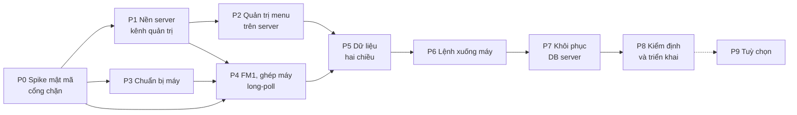

# Kế hoạch triển khai server mẹ FlexMix (bản 2)

- **Trạng thái:** CHƯA THỰC HIỆN. Chưa có dòng code nào.
- **Lập ngày:** 2026-10-08.
- **Nguồn thiết kế:** `docs/server_architect.html` (bản 2). User chuyển sang bước lập plan ngày 08/10.
- **Hồ sơ nền:**
  - `agents/memory/hieu_biet_server_me.md`
  - `agents/memory/phuong_an_kien_truc.md`
  - `agents/memory/crypto_*.md`
  - `agents/memory/quy_uoc_so_do.md`

Mỗi phase có một file riêng trong thư mục này. Các file đó ghi phase con, bước, file, phép kiểm và cách quay lui.

## Bạn cần biết

1. **Có 10 phase, từ P0 tới P9.**
   - P0 là cổng chặn mật mã. Nếu P0 không đạt thì dừng lại hỏi user, không tự ghép primitive khác.
   - P9 là tuỳ chọn.
2. **Plan lệch mục 12 (Lộ trình) của thiết kế ở ba chỗ.** Lý do từng chỗ:
   - **Ghép máy (M1) và thu hồi (M5) dời ra sau FM1** (P4). Lý do: enroll đi bằng FM1 với kid `enroll`, nên không làm trước FM1 được.
   - **Thêm hai phase chức năng mà mục 12 không liệt kê.** P2 là quản trị menu trên server. P5 là dữ liệu hai chiều giữa máy và server. Thiếu hai phase này thì server không thay được admin_gui.
   - **Xoá `admin_gui` trên máy dời về P8** (triển khai). Lý do: máy phải giữ công cụ quản trị cũ cho tới khi server mẹ chạy được trên máy thật.
3. **Có 10 câu hỏi chờ user**, ghi ở mục cuối.
   - Q6 và Q8 chặn ngay từ đầu.
   - Các câu còn lại chỉ chặn đúng bước cần tới.
4. **Plan không có lịch và không có ngưỡng tải.** Số đo nào cũng phải lấy trên thiết bị thật, ở phase ghi rõ.

## Hiện trạng có bằng chứng

### Thư mục server

| Điều | Nguồn |
|---|---|
| `server/server/main.py` rỗng (0 byte) | `ls -la server/server` |
| `server/routing.py` giống hệt `server/server/config/routing.py` | `diff -q` không in gì |
| routing hai bản trên vẫn theo bản 1: token, `AGENT_HEARTBEAT_PATH`, GET commands, `AGENT_COMMAND_RESULT_PATH` | `routing.py:28`, `:120-129` |
| `server/` chưa phải git repo | `git` không có trong thư mục |

### Máy (version1.0)

| Điều | Nguồn |
|---|---|
| `version1.0` là git repo | `git log`: `9273508 Fix drink toggle/price…` |
| admin_gui có 3.817 dòng và 44 hằng `_PATH` | `version1.0/admin_gui/serve.py` |
| Phần đăng nhập và quyền của admin_gui | `auth.py` 875 dòng, `permissions.py` 366 dòng |
| admin_gui có 14 trang HTML | `version1.0/admin_gui/*.html` |
| Màn bán hàng phụ thuộc admin_gui | `store_gui/serve.py:96` import `admin_gui.serve`; dùng ở `:435` và `:569-572` (upload ảnh) |
| POS đọc order-mode qua route của admin_gui | `store_gui/drinks-pos.js:1549`: `ORDER_MODE_URL = '../api/order-mode'` |
| `served_paths.py` còn mục admin_gui | `configuration/served_paths.py:74` |
| `cryptography` chỉ được import, chưa ghim phiên bản | `deploy/install.sh:223` |
| Bước tạo tài khoản admin dùng `admin_gui.auth` | `deploy/install.sh:387-402` |
| Cơ chế thử độ phân giải dùng `threading.Timer` | `admin_gui/serve.py:3219-3337`, timer ở `:3304` |
| Hàm dựng `menu-data.js` | `store_gui/sync_menu.py:893` `publish_menu()` |
| Migration của máy đang có `0001_baseline` và `0002_ticket_updated_at` | `database/migrations/` |
| Test hiện có chạy bằng pytest | `version1.0/qrproto/tests/` |
| Có thêm nhánh `version1.1` (git, có admin_gui riêng) | `version1.1/` |

## Sơ đồ phụ thuộc

- P2 và P3 chạy song song được sau P1 và P0.
- Các phase còn lại đi tuần tự.

## Bảng phase

| ID | Tên | Luồng trong thiết kế | Phụ thuộc | Cổng ra (tóm tắt) | File |
|---|---|---|---|---|---|
| P0 | Spike mật mã và khởi tạo | mục 4, 10 | Q8 | HPKE liên thông byte-exact, test âm đạt, có số đo trên Pi thật | [P0_spike.md](P0_spike.md) |
| P1 | Nền server và kênh quản trị | A1, A2, A3, mục 8 | P0 | Trình duyệt và điện thoại quản trị đăng nhập được qua HTTPS; test Bảo mật A đạt | [P1_nen_server.md](P1_nen_server.md) |
| P2 | Quản trị menu trên server | N1–N4, N6 (server), K4, D3 (trang) | P1, Q7 | Sửa món, menu, gán máy trên server; mỗi lần lưu tạo `menu_version` | [P2_menu_server.md](P2_menu_server.md) |
| P3 | Chuẩn bị máy | M2, mục 9 bước 1, 3–7 | P0 (ghim thư viện), Q6 | Màn bán hàng không còn gọi admin_gui; agent và helper chạy bằng user riêng; kiosk không đọc được thư mục khoá | [P3_chuan_bi_may.md](P3_chuan_bi_may.md) |
| P4 | FM1, ghép máy, long-poll | M1, M3, M4, M5, mục 4 | P0, P1, P3 | Phát lại, đổi route, đổi byte đều bị chặn; ghép và thu hồi chạy trên Pi thật | [P4_fm1_ghep_may.md](P4_fm1_ghep_may.md) |
| P5 | Dữ liệu hai chiều | N5, N6 (máy), D1, D2, K3 | P2, P4 | Đổi giá trên server thì màn bán hàng hiện giá mới; đơn, lỗi, tồn kho lên server đủ và không trùng | [P5_du_lieu_hai_chieu.md](P5_du_lieu_hai_chieu.md) |
| P6 | Lệnh xuống máy | L0, K1, K2, L1–L4 | P5, Q3 | Mất response giữa chừng không làm nạp hai lần; thử màn hình tự hoàn tác | [P6_lenh.md](P6_lenh.md) |
| P7 | Khôi phục DB server | M6 | P6 | Khôi phục bằng tay vẫn bị phát hiện; lệnh unknown được đối soát | [P7_khoi_phuc.md](P7_khoi_phuc.md) |
| P8 | Kiểm định và triển khai | mục 11, mục 9 bước 2 | P7, Q2, Q9 | Không còn lỗi chặn; máy thật chạy không cần admin_gui; có runbook | [P8_kiem_dinh_trien_khai.md](P8_kiem_dinh_trien_khai.md) |
| P9 | Tuỳ chọn | mục 4.7 "hoãn P7" | P8 và yêu cầu user | Theo nhu cầu | [P9_tuy_chon.md](P9_tuy_chon.md) |

## Đối chiếu với mục 12 của thiết kế

| Mục 12 | Plan | Ghi chú |
|---|---|---|
| P0 Spike | P0 | Thêm: khởi tạo repo, gom routing về một bản |
| P1 CA, TLS, hai cổng, phiên, CSP, rate-limit | P1 | Thêm: schema DB server, A1–A3 |
| P2 Ghép máy, thu hồi, user agent, helper, /opt | P3 + P4 | Phần máy ở P3; ghép và thu hồi sang P4 vì cần FM1 |
| P3 FM1 hai phía, ROUTE_POLICY, claim, high-water | P4 | |
| P4 Vòng đời lệnh, ledger, outbox, idempotency | P6 | |
| P5 server_epoch, restore.sh, đối soát | P7 | |
| P6 Test phản ví dụ, mất điện, tải, runbook | P8 | Thêm: cắt chuyển khỏi admin_gui |
| P7 Tuỳ chọn | P9 | |
| (không có) | P2, P5 | Chức năng quản trị và dữ liệu, thiếu thì không thay được admin_gui |

Chữ "P6" và "P7" trong thân thiết kế (ví dụ "thử mất điện ở P6", "xoay khoá để P7") là theo số của mục 12. Trong plan, hai việc này tương ứng P8 và P9.

## Luồng nào làm ở phase nào

| Luồng | Phase |
|---|---|
| M1 Ghép máy | P4 |
| M2 Đồng bộ giờ | P3 (máy) + P1 (chrony server) |
| M3 Long-poll | P4 (khung), P6 (lệnh) |
| M4 Middleware FM1 | P4 |
| M5 Thu hồi | P4 |
| M6 Khôi phục DB server | P7 |
| A1 Đăng nhập · A2 Nhân viên · A3 Gán máy | P1 |
| N1 Thư viện món · N2 Sửa menu · N3 Sao chép · N4 Gán menu | P2 |
| N5 Máy áp menu | P5 |
| N6 Thùng rác | P2 (server) + P5 (máy) |
| K1 Xem nguyên liệu · K2 Nạp, sửa, xoá | P6 |
| K3 Máy báo tồn kho | P5 |
| K4 Sổ cấp id nguyên liệu | P2 |
| D1 Đơn · D2 Lỗi | P5 |
| D3 Báo cáo | P2 (trang, đọc bản sao rỗng) + P5 (có dữ liệu) |
| L0 Vòng đời lệnh · L1 Vé, lỗi · L2 In lại · L3 Order-mode · L4 Màn hình | P6 |

## Quy ước chung

### Trạng thái từng bước

| Ký hiệu | Nghĩa |
|---|---|
| ○ | Chưa làm |
| → | Đang làm hoặc đang review |
| ✓ | Đạt. Cần reviewer duyệt **và** phép kiểm của bước đã chạy đạt |
| ✗ | Chưa đạt. Ghi nguyên nhân và bước sửa |
| ⏸ | Chờ phụ thuộc hoặc chờ user chốt |

- Bước phụ thuộc không được đi tiếp khi bước trước chưa ✓.
- Lỗi đã sửa vẫn giữ lịch sử trong file phase.

### Vai trong mỗi bước

Theo quy trình user đã chốt:

1. Tester viết test hoặc harness trước, nếu bước có phép kiểm tự động.
2. Coder làm.
3. Reviewer kiểm độc lập.
4. Operator cập nhật trạng thái trong plan và trên trang HTML.

Riêng P0, P4 và P8 có thêm cybersecurity và hacker. Định nghĩa vai nằm ở `agents/*.md`.

### Cách viết code

- Bám kiểu code của version1.0:
  - mỗi route là một hằng `_PATH`;
  - SQL viết tay;
  - migration đánh số `NNNN_ten.sql`;
  - test chạy bằng pytest.
- Không thêm thư viện ngoài danh sách trong mục 10 của thiết kế: Flask, cheroot, mysql-connector, cryptography. PyHPKE chỉ được dùng trong test.
- Kiểu luồng: kiểm sai rồi thoát sớm. Mỗi file giữ một trách nhiệm chính, như cây thư mục ở mục 10.

### Nơi chạy

| Nơi | Thông tin |
|---|---|
| Máy dev | Windows, Python 3.14, cryptography 50.0.1 (`crypto_A_diem_trien_khai.md:226`) |
| Server | Linux trong LAN. Phần cứng chưa chốt (Q9) |
| Máy bán hàng | Pi 5, MySQL `beveragepos`, store_gui ở cổng 8080 (loopback + Tailscale) |

Số đo hiệu năng chỉ tính khi lấy trên Pi thật và máy server thật.

## Câu hỏi chờ user (⏸)

| ID | Câu hỏi | Chặn |
|---|---|---|
| Q1 | Chấp nhận các chỗ lệch R5 ở mục 13: cryptography + resp_key, Ed25519, idempotency key + epoch, W + high-water, hoãn manifest, media ngoài FM1, giới hạn thông báo thu hồi? | P4.1 (chốt định dạng gói). P0 vẫn chạy được để lấy số liệu |
| Q2 | Có cài root CA nội bộ lên máy tính và điện thoại quản trị, kể cả điện thoại nhân viên bấm "Giữ" ở L4, không? | P1.4 nghiệm thu trên thiết bị, P8 |
| Q3 | Có bắt nhập lại mật khẩu khi chuyển vé "đã dùng" về "chưa dùng" (B12) không? | P6.4 (L1) |
| Q4 | Các tham số chưa có giá trị đề xuất: hạn cert leaf, N giờ gửi lại ledger | P1.4, P7.3. Các tham số đã có giá trị đề xuất thì dùng làm mặc định (bảng dưới) |
| Q5 | Có cho app Android theo R5 nói chuyện trực tiếp với server mẹ không? | Không chặn. Nếu có thì cần thêm một phase |
| Q6 | Sửa phía máy trên nhánh nào: `version1.0` hay `version1.1`? | P3, P4.6 trở đi |
| Q7 | Dữ liệu ban đầu của server (thư viện món, công thức, ảnh, tài khoản) lấy từ đâu: nhập từ DB một máy đang chạy hay nhập tay? Lịch sử đơn cũ trên máy có đưa lên server không? | P2.6, P8.4 |
| Q8 | Cho phép `git init` thư mục `server/` không? | P0.1 |
| Q9 | Máy chạy server là máy nào, IP cố định đặt ở đâu, tên miền hoặc IP nào sẽ in vào cert? Có bao nhiêu máy bán hàng? | P1.4 nghiệm thu thật, P0.5, P8 |
| Q10 | Sau khi server khôi phục, máy gửi lại ledger qua route nào? Thiết kế chưa ghi. Đề xuất: qua `AGENT_HELLO_PATH`, vì bảng gói tin ở mục 7 đã cho hello mang "ledger kết quả chưa được ACK"; khi epoch đổi thì mở rộng thành ledger N giờ | P7.3 |

### Tham số đã có đề xuất trong thiết kế

Các giá trị dưới đây dùng làm mặc định trong cấu hình. User đổi được mà không phải sửa code.

| Tham số | Mặc định | Nguồn trong thiết kế |
|---|---|---|
| W, cửa sổ giờ | 120 s | M2 |
| Mã ghép | 10 phút, 5 lần thử sai | M1 |
| Thông báo thu hồi | 1 lần mỗi phút cho mỗi kid | M5 |
| Giữ ledger | 30 ngày | mục 6 |
| Cổng quản trị | 443 | mục 6, bảng cổng |
| Cổng agent | 8443 | mục 6, bảng cổng |
| Long-poll `wait` | tối đa 25 s | mục 7 |
| Hạn lệnh | đọc 5 s; ghi 30 s; in lại 2 phút; màn hình 10 s | mục 7 |
